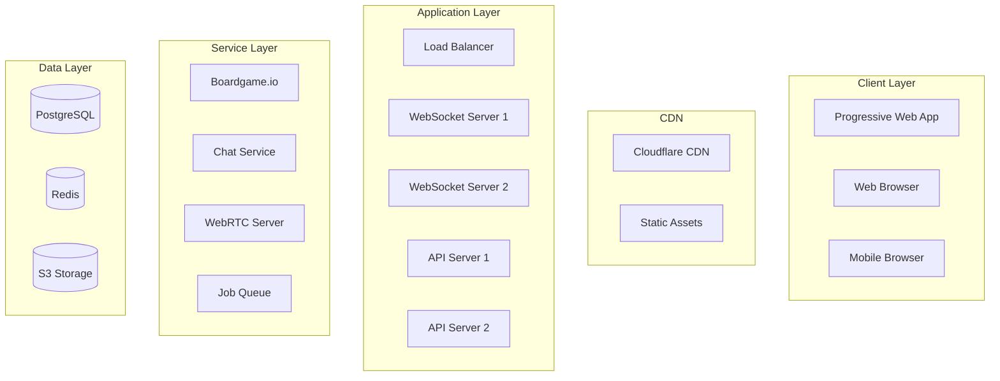

# TI4 Web App - Complete Technical Specification v2.0

## Executive Summary
This specification encompasses a complete Twilight Imperium 4th Edition web application including Prophecy of Kings expansion, advanced game mechanics, social features, and companion app mode. Leveraging existing open-source repositories will provide ~60% of required assets and reference logic, with ~40% requiring new development.

---

## Part 1: Technology Stack & Architecture

### Core Technologies
```yaml
Frontend:
  Framework: React 18 with TypeScript 5.x
  3D Engine: Three.js with React Three Fiber
  State Management: Zustand + Boardgame.io client
  Styling: Tailwind CSS + CSS Modules
  Build Tool: Vite 5.x
  Testing: Vitest + React Testing Library + Cypress

Backend:
  Runtime: Node.js 20 LTS
  Framework: Express + Boardgame.io server
  Database: PostgreSQL 15 with Prisma ORM
  Cache: Redis 7
  Real-time: Socket.io (via Boardgame.io)
  Queue: Bull MQ for background jobs

Communication:
  Chat: Socket.io
  Voice/Video: WebRTC with Mediasoup
  Notifications: Web Push API + Email (SendGrid)

Infrastructure:
  Container: Docker + Docker Compose
  CI/CD: GitHub Actions
  Monitoring: Sentry + DataDog
  Analytics: Plausible
  CDN: Cloudflare
  Storage: S3-compatible (for replays/saves)
```

### System Architecture


---

## Part 2: Repository Integration Map

### Primary Sources

#### 🎯 AsyncTI4/ti4_web_new (TypeScript/React)
```typescript
EXTRACTION STATUS: Direct Fork
├── ✅ UI Components (80% usable)
├── ✅ TypeScript Types (extend)
├── ✅ Map Components (enhance to 3D)
├── ✅ Asset Pipeline (complete)
└── ⚠️  Game Logic (partial, needs completion)
```

#### 📚 TwilightImperiumUltimate (C#/Blazor)
```typescript
EXTRACTION STATUS: Data Conversion Required
├── ✅ All Factions (25+ including PoK)
├── ✅ Complete Card Database
├── ✅ Technology Trees
├── ✅ Planet/System Data
├── ✅ Objectives Database
├── ✅ Exploration Cards (PoK)
└── ✅ Leader Data (PoK)
```

#### ⚔️ ti4calc (JavaScript)
```typescript
EXTRACTION STATUS: Direct Port to TypeScript
├── ✅ Combat Resolution
├── ✅ Dice Rolling System
├── ✅ Probability Calculator
└── ✅ Combat Modifiers
```

#### 🗺️ KeeganW/ti4 (React)
```typescript
EXTRACTION STATUS: Algorithm Extraction
├── ✅ Map Generation Logic
├── ✅ Balance Scoring
├── ✅ Preset Configurations
└── ✅ Tile Placement Rules
```

#### 🎲 von-grid (JavaScript/Three.js)
```typescript
EXTRACTION STATUS: Complete Library
├── ✅ Hexagonal Grid System
├── ✅ Pathfinding (A*)
├── ✅ Grid Mathematics
└── ✅ 3D Helpers
```

#### 📖 AsyncTI4/TI4_map_generator_bot (Java)
```typescript
EXTRACTION STATUS: Reference Only (Study for Logic)
├── 📚 Complete Rule Implementation
├── 📚 Phase Management
├── 📚 Action Validation
├── 📚 PoK Mechanics
└── 📚 Faction Abilities
```

---

## Part 3: Complete Feature Specification

### Core Game Engine
```typescript
interface GameEngine {
  // Phase Management
  phases: {
    strategy: StrategyPhaseHandler;
    action: ActionPhaseHandler;
    status: StatusPhaseHandler;
    agenda: AgendaPhaseHandler;
  };
  
  // Turn Management
  turnOrder: TurnOrderManager;
  simultaneousActions: SimultaneousActionHandler;
  timing: TimingWindowManager;
  
  // Action System
  actions: {
    tactical: TacticalActionHandler;
    strategic: StrategicActionHandler;
    component: ComponentActionHandler;
    pass: PassActionHandler;
  };
  
  // Validation
  validator: {
    movement: MovementValidator;
    combat: CombatValidator;
    build: BuildValidator;
    tech: TechnologyValidator;
    politics: PoliticsValidator;
    trade: TradeValidator;
  };
  
  // Special Systems
  factions: FactionAbilityManager;
  promissory: PromissoryNoteHandler;
  relics: RelicHandler;
  exploration: ExplorationManager; // PoK
  leaders: LeaderManager; // PoK
  mechs: MechManager; // PoK
}
```

### Combat System (Complete)
```typescript
interface CombatSystem {
  // Core Combat
  spaceCombat: SpaceCombatResolver;
  groundCombat: GroundCombatResolver;
  
  // Advanced Mechanics
  spaceCannon: {
    offense: SpaceCannonOffense;
    defense: SpaceCannonDefense;
  };
  bombardment: BombardmentResolver;
  antiFighterBarrage: AFBResolver;
  
  // Combat Features
  retreat: RetreatHandler;
  sustainDamage: SustainDamageHandler;
  repair: RepairHandler;
  
  // Modifiers
  modifiers: CombatModifierCalculator;
  abilities: CombatAbilityResolver;
  
  // Probability
  calculator: ProbabilityCalculator;
  simulator: MonteCarloCombatSimulator;
}
```

### Prophecy of Kings Content
```typescript
interface ProphecyOfKings {
  // Exploration
  exploration: {
    culturalDeck: ExplorationDeck;
    industrialDeck: ExplorationDeck;
    hazardousDeck: ExplorationDeck;
    fragments: RelicFragmentManager;
    attachments: AttachmentManager;
  };
  
  // Leaders
  leaders: {
    agents: AgentManager;
    commanders: CommanderManager;
    heroes: HeroManager;
    alliance: AllianceManager;
  };
  
  // Mechs
  mechs: {
    deployment: MechDeploymentRules;
    abilities: Map<FactionId, MechAbility>;
    combatStats: MechCombatStats;
  };
  
  // New Factions
  factions: {
    argent: ArgentFlightFaction;
    empyrean: EmpyreanFaction;
    mahact: MahactGeneSorcerers;
    naazRokha: NaazRokhaAlliance;
    nomad: NomadFaction;
    titans: TitansOfUl;
    vulRaith: VulRaithCabal;
  };
}
```

### Movement & Board Mechanics
```typescript
interface MovementSystem {
  // Wormholes
  wormholes: {
    alpha: AlphaWormholeNetwork;
    beta: BetaWormholeNetwork;
    gamma: GammaWormholeNetwork;
    legendary: LegendaryWormholes;
  };
  
  // Anomalies
  anomalies: {
    gravityRift: GravityRiftEffect;
    nebula: NebulaEffect;
    supernova: SupernovaEffect;
    asteroidField: AsteroidFieldEffect;
  };
  
  // Movement
  calculator: {
    range: MovementRangeCalculator;
    path: PathfindingEngine;
    fleetSupply: FleetSupplyValidator;
    capacity: CapacityChecker;
  };
}
```

### Social & Communication
```typescript
interface SocialFeatures {
  // Text Chat
  chat: {
    public: PublicChatRoom;
    team: TeamChat;
    whisper: PrivateMessaging;
    history: ChatHistoryManager;
    moderation: ChatModerationTools;
  };
  
  // Voice/Video
  voiceVideo: {
    voice: WebRTCVoiceChat;
    video: WebRTCVideoChat;
    screenshare: ScreenShareManager;
    settings: AudioVideoSettings;
  };
  
  // Trading
  negotiation: {
    builder: TransactionBuilder;
    validator: DealValidator;
    escrow: EscrowSystem;
    history: TradeHistoryTracker;
  };
  
  // Social
  emotes: EmoteSystem;
  friendsList: FriendsManager;
  blocking: BlockListManager;
}
```

### Game Management
```typescript
interface GameManagement {
  // Lobby
  lobby: {
    creation: GameCreationWizard;
    settings: GameSettingsManager;
    slots: PlayerSlotManager;
    mapSelection: MapPresetSelector;
    draft: FactionDraftSystem;
    ready: ReadyCheckSystem;
  };
  
  // Tournament
  tournament: {
    formats: SwissSystem | BracketSystem;
    scheduling: RoundScheduler;
    timer: TournamentTimer;
    standings: StandingsCalculator;
    admin: TournamentAdminPanel;
  };
  
  // Saves
  saves: {
    local: LocalSaveManager;
    cloud: CloudSaveSync;
    auto: AutoSaveSystem;
    import: SaveImporter;
    export: SaveExporter;
  };
  
  // Replay
  replay: {
    recorder: GameRecorder;
    viewer: ReplayViewer;
    controls: PlaybackControls;
    sharing: ReplaySharingSystem;
    analysis: GameAnalyzer;
  };
}
```

### Companion App Features
```typescript
interface CompanionMode {
  // Core Features
  mode: 'digital' | 'physical-tracking' | 'hybrid';
  
  // Physical Game Support
  physical: {
    stateTracking: ManualStateInput;
    scoreKeeping: ScoreTracker;
    turnTimer: TurnTimerSystem;
    photoCapture: BoardPhotoCapture;
    qrScanning: QRCodeScanner;
  };
  
  // Advisory System
  advisor: {
    legalMoves: LegalMoveCalculator;
    suggestions: StrategySuggester;
    probability: OutcomeCalculator;
    objectives: ObjectiveAdvisor;
    combatOdds: CombatOddsDisplay;
  };
  
  // Mobile Optimization
  mobile: {
    responsiveUI: MobileUIAdapter;
    touchControls: TouchGestureHandler;
    reducedGraphics: PerformanceMode;
    offlineMode: OfflineCapability;
  };
}
```

### Tutorial & Help System
```typescript
interface TutorialSystem {
  // Interactive Tutorial
  tutorial: {
    basics: BasicGameplayTutorial;
    advanced: AdvancedMechanicsTutorial;
    faction: FactionSpecificTutorials;
    scenarios: PracticeScenarios;
    progression: TutorialProgressTracker;
  };
  
  // Help System
  help: {
    contextual: ContextualHintSystem;
    rules: SearchableRulesDatabase;
    faq: FrequentlyAskedQuestions;
    videos: VideoTutorialLibrary;
    tooltips: EnhancedTooltipSystem;
  };
  
  // AI Assistant
  assistant: {
    suggestions: MoveSuggestionEngine;
    explanation: RuleExplainer;
    strategy: StrategyAdvisor;
  };
}
```

---

## Part 4: Implementation Roadmap (Revised)

### Phase 1: Foundation & Core (Weeks 1-4)
**Goal:** Establish project structure and import existing code

- Fork AsyncTI4/ti4_web_new
- Set up monorepo with Lerna
- Configure Docker environment
- Extract data from TwilightImperiumUltimate
- Port combat engine from ti4calc
- Integrate von-grid for hexagonal math
- Set up CI/CD pipeline

### Phase 2: Game Engine Core (Weeks 5-10)
**Goal:** Implement complete rule engine

- Study AsyncTI4 Java bot extensively
- Implement phase management system
- Build action validation framework
- Create basic faction abilities
- Implement core combat system
- Add movement and board mechanics
- Create trade and politics systems

### Phase 3: Prophecy of Kings (Weeks 11-13)
**Goal:** Add expansion content

- Implement exploration system
- Add leader mechanics (Agents/Commanders/Heroes)
- Implement mech system
- Add new factions
- Integrate relic fragments
- Add planet attachments

### Phase 4: Advanced Combat & Movement (Weeks 14-15)
**Goal:** Complete combat and movement systems

- Space Cannon offense/defense
- Anti-Fighter Barrage
- Bombardment system
- Retreat mechanics
- Wormhole networks
- Anomaly effects
- Fleet supply validation

### Phase 5: 3D Visualization (Weeks 16-18)
**Goal:** Create immersive 3D board

- Three.js scene setup
- 3D model integration
- Camera controls
- Selection system
- Animation framework
- Lighting and effects
- Performance optimization

### Phase 6: Multiplayer Infrastructure (Weeks 19-21)
**Goal:** Real-time multiplayer gameplay

- Boardgame.io server configuration
- PostgreSQL schema implementation
- Lobby system
- Game creation flow
- Faction drafting
- Reconnection handling
- Spectator mode

### Phase 7: Social Features (Weeks 22-23)
**Goal:** Communication and community

- Chat system
- Transaction negotiator
- Emote system
- Friends list
- Voice/video setup (basic)
- Notification system

### Phase 8: Companion & Mobile (Weeks 24-25)
**Goal:** Dual-mode support

- Companion app architecture
- Physical game tracking
- Advisory system
- Mobile optimization
- PWA configuration
- Offline capabilities

### Phase 9: Polish & Launch Prep (Weeks 26-28)
**Goal:** Production readiness

- Tutorial system
- Save/load functionality
- Replay system (basic)
- Performance optimization
- Accessibility features
- Bug fixes and testing
- Documentation

### Phase 10: Post-Launch Features (Weeks 29+)
**Goal:** Enhanced features

- Tournament system
- Advanced replay analysis
- AI opponents
- Admin panel
- Advanced WebRTC features
- Mod support

---

## Part 5: Complete Project Structure

```
ti4-web-app/
├── .github/
│   ├── workflows/
│   │   ├── ci.yml
│   │   ├── deploy-staging.yml
│   │   ├── deploy-production.yml
│   │   └── dependency-update.yml
│   ├── ISSUE_TEMPLATE/
│   │   ├── bug_report.md
│   │   ├── feature_request.md
│   │   └── balance_issue.md
│   └── PULL_REQUEST_TEMPLATE.md
│
├── client/                            # Frontend Application
│   ├── public/
│   │   ├── assets/                   # [EXTRACTED from AsyncTI4/ti4_web_new]
│   │   │   ├── factions/             # 25+ faction assets
│   │   │   ├── cards/                # All card types
│   │   │   ├── tokens/               # Game tokens
│   │   │   ├── units/                # Unit sprites
│   │   │   ├── planets/              # Planet images
│   │   │   ├── systems/              # System tiles
│   │   │   ├── exploration/          # [NEW] PoK exploration
│   │   │   ├── leaders/              # [NEW] PoK leaders
│   │   │   └── icons/                # UI icons
│   │   ├── models/                   # 3D models
│   │   │   ├── ships/
│   │   │   ├── structures/
│   │   │   ├── ground/
│   │   │   ├── mechs/                # [NEW] PoK mechs
│   │   │   └── board/
│   │   ├── fonts/
│   │   ├── sounds/
│   │   │   ├── effects/
│   │   │   ├── music/
│   │   │   └── voice/                # Voice lines
│   │   ├── locales/                  # [NEW] i18n
│   │   ├── manifest.json             # [NEW] PWA manifest
│   │   └── index.html
│   │
│   ├── src/
│   │   ├── game/                     # Core Game Logic
│   │   │   ├── engine/
│   │   │   │   ├── GameEngine.ts
│   │   │   │   ├── PhaseManager.ts
│   │   │   │   ├── TurnManager.ts
│   │   │   │   ├── StateManager.ts
│   │   │   │   └── TimingWindows.ts  # [NEW]
│   │   │   ├── phases/
│   │   │   │   ├── StrategyPhase.ts
│   │   │   │   ├── ActionPhase.ts
│   │   │   │   ├── StatusPhase.ts
│   │   │   │   └── AgendaPhase.ts
│   │   │   ├── actions/
│   │   │   │   ├── TacticalAction.ts
│   │   │   │   ├── StrategicAction.ts
│   │   │   │   ├── ComponentAction.ts
│   │   │   │   └── PassAction.ts
│   │   │   ├── validation/
│   │   │   │   ├── ActionValidator.ts
│   │   │   │   ├── MovementValidator.ts
│   │   │   │   ├── BuildValidator.ts
│   │   │   │   ├── CombatValidator.ts
│   │   │   │   ├── TechValidator.ts
│   │   │   │   └── TradeValidator.ts # [NEW]
│   │   │   ├── combat/                # [EXTENDED from ti4calc]
│   │   │   │   ├── CombatEngine.ts
│   │   │   │   ├── SpaceCombat.ts
│   │   │   │   ├── GroundCombat.ts
│   │   │   │   ├── SpaceCannon.ts    # [NEW]
│   │   │   │   ├── Bombardment.ts    # [NEW]
│   │   │   │   ├── AFBarrage.ts      # [NEW]
│   │   │   │   ├── Retreat.ts        # [NEW]
│   │   │   │   ├── DiceRoller.ts
│   │   │   │   ├── CombatModifiers.ts
│   │   │   │   └── ProbabilityCalculator.ts
│   │   │   ├── movement/              # [NEW]
│   │   │   │   ├── WormholeNetwork.ts
│   │   │   │   ├── AnomalyEffects.ts
│   │   │   │   ├── MovementCalculator.ts
│   │   │   │   ├── FleetSupply.ts
│   │   │   │   └── Pathfinding.ts
│   │   │   ├── exploration/           # [NEW] PoK
│   │   │   │   ├── ExplorationManager.ts
│   │   │   │   ├── RelicFragments.ts
│   │   │   │   ├── ExplorationDecks.ts
│   │   │   │   └── Attachments.ts
│   │   │   ├── leaders/               # [NEW] PoK
│   │   │   │   ├── LeaderManager.ts
│   │   │   │   ├── Agents.ts
│   │   │   │   ├── Commanders.ts
│   │   │   │   ├── Heroes.ts
│   │   │   │   └── Alliance.ts
│   │   │   ├── mechs/                 # [NEW] PoK
│   │   │   │   ├── MechManager.ts
│   │   │   │   ├── MechAbilities.ts
│   │   │   │   └── MechDeployment.ts
│   │   │   ├── factions/
│   │   │   │   ├── FactionManager.ts
│   │   │   │   ├── abilities/        # All faction abilities
│   │   │   │   └── starting/         # Starting setups
│   │   │   ├── objectives/
│   │   │   │   ├── ObjectiveManager.ts
│   │   │   │   ├── PublicObjectives.ts
│   │   │   │   ├── SecretObjectives.ts
│   │   │   │   └── Scoring.ts
│   │   │   ├── politics/
│   │   │   │   ├── VotingSystem.ts
│   │   │   │   ├── AgendaResolver.ts
│   │   │   │   ├── LawManager.ts
│   │   │   │   └── Riders.ts
│   │   │   ├── trade/
│   │   │   │   ├── TradeSystem.ts
│   │   │   │   ├── Commodities.ts
│   │   │   │   ├── TransactionBuilder.ts
│   │   │   │   └── PromissoryNotes.ts
│   │   │   └── boardgame-io/
│   │   │       ├── TI4Game.ts
│   │   │       ├── moves.ts
│   │   │       ├── plugins.ts
│   │   │       └── events.ts
│   │   │
│   │   ├── components/
│   │   │   ├── board/
│   │   │   │   ├── Board3D.tsx       # Three.js board
│   │   │   │   ├── Board2D.tsx       # 2D fallback
│   │   │   │   ├── HexTile3D.tsx
│   │   │   │   ├── SystemTile.tsx
│   │   │   │   ├── PlanetTile.tsx
│   │   │   │   ├── AnomalyTile.tsx   # [NEW]
│   │   │   │   ├── WormholeTile.tsx  # [NEW]
│   │   │   │   └── MecatolRex.tsx
│   │   │   ├── units/
│   │   │   │   ├── Unit3D.tsx
│   │   │   │   ├── Ship3D.tsx
│   │   │   │   ├── GroundForce3D.tsx
│   │   │   │   ├── Structure3D.tsx
│   │   │   │   ├── Mech3D.tsx        # [NEW]
│   │   │   │   ├── Leader3D.tsx      # [NEW]
│   │   │   │   └── UnitSelector.tsx
│   │   │   ├── lobby/                 # [NEW]
│   │   │   │   ├── GameLobby.tsx
│   │   │   │   ├── PlayerSlots.tsx
│   │   │   │   ├── GameSettings.tsx
│   │   │   │   ├── MapSelection.tsx
│   │   │   │   ├── DraftMode.tsx
│   │   │   │   └── ReadyCheck.tsx
│   │   │   ├── map/
│   │   │   │   ├── MapGenerator.tsx
│   │   │   │   ├── MapBalancer.tsx
│   │   │   │   ├── MapPresets.tsx
│   │   │   │   └── MapStringParser.tsx
│   │   │   ├── player/
│   │   │   │   ├── PlayerDashboard.tsx
│   │   │   │   ├── PlayerArea.tsx
│   │   │   │   ├── ResourceTracker.tsx
│   │   │   │   ├── TechTree.tsx
│   │   │   │   ├── HandManager.tsx
│   │   │   │   ├── LeaderPanel.tsx   # [NEW]
│   │   │   │   └── ExplorationPanel.tsx # [NEW]
│   │   │   ├── ui/
│   │   │   │   ├── ActionMenu.tsx
│   │   │   │   ├── PhaseIndicator.tsx
│   │   │   │   ├── TurnOrder.tsx
│   │   │   │   ├── ObjectiveDisplay.tsx
│   │   │   │   ├── ScoreBoard.tsx
│   │   │   │   ├── NotificationSystem.tsx
│   │   │   │   ├── TimerDisplay.tsx  # [NEW]
│   │   │   │   └── SaveLoadMenu.tsx  # [NEW]
│   │   │   ├── communication/         # [NEW]
│   │   │   │   ├── ChatSystem.tsx
│   │   │   │   ├── VoiceChat.tsx
│   │   │   │   ├── VideoChat.tsx
│   │   │   │   ├── EmoteWheel.tsx
│   │   │   │   └── TransactionNegotiator.tsx
│   │   │   ├── cards/
│   │   │   │   ├── CardDisplay.tsx
│   │   │   │   ├── CardHand.tsx
│   │   │   │   ├── CardEffects.tsx
│   │   │   │   ├── ExplorationCard.tsx # [NEW]
│   │   │   │   └── RelicCard.tsx     # [NEW]
│   │   │   ├── combat/
│   │   │   │   ├── CombatDialog.tsx
│   │   │   │   ├── DiceRollAnimation.tsx
│   │   │   │   ├── CombatLog.tsx
│   │   │   │   ├── RetreatDialog.tsx # [NEW]
│   │   │   │   └── BombardmentUI.tsx # [NEW]
│   │   │   ├── trade/
│   │   │   │   ├── TradeInterface.tsx
│   │   │   │   ├── TransactionBuilder.tsx
│   │   │   │   ├── PromissoryNotes.tsx
│   │   │   │   └── CommodityExchange.tsx
│   │   │   ├── politics/
│   │   │   │   ├── VotingInterface.tsx
│   │   │   │   ├── AgendaCard.tsx
│   │   │   │   ├── SpeakerToken.tsx
│   │   │   │   └── RiderDialog.tsx   # [NEW]
│   │   │   ├── companion/
│   │   │   │   ├── CompanionMode.tsx
│   │   │   │   ├── PhysicalGameTracker.tsx
│   │   │   │   ├── MoveAdvisor.tsx
│   │   │   │   ├── SimplifiedUI.tsx
│   │   │   │   ├── QRScanner.tsx
│   │   │   │   └── PhotoCapture.tsx  # [NEW]
│   │   │   ├── spectator/             # [NEW]
│   │   │   │   ├── SpectatorMode.tsx
│   │   │   │   ├── ReplayViewer.tsx
│   │   │   │   ├── ReplayControls.tsx
│   │   │   │   ├── GameTimeline.tsx
│   │   │   │   └── AnalysisPanel.tsx
│   │   │   ├── tutorial/              # [NEW]
│   │   │   │   ├── InteractiveTutorial.tsx
│   │   │   │   ├── TutorialScenarios.tsx
│   │   │   │   ├── HintSystem.tsx
│   │   │   │   ├── RulesReference.tsx
│   │   │   │   └── VideoGuides.tsx
│   │   │   ├── tournament/            # [NEW]
│   │   │   │   ├── TournamentLobby.tsx
│   │   │   │   ├── BracketView.tsx
│   │   │   │   ├── SwissRounds.tsx
│   │   │   │   ├── TournamentTimer.tsx
│   │   │   │   └── Standings.tsx
│   │   │   ├── admin/                 # [NEW]
│   │   │   │   ├── AdminDashboard.tsx
│   │   │   │   ├── UserManagement.tsx
│   │   │   │   ├── GameModeration.tsx
│   │   │   │   ├── Reports.tsx
│   │   │   │   └── Analytics.tsx
│   │   │   └── shared/
│   │   │       ├── Modal.tsx
│   │   │       ├── Tooltip.tsx
│   │   │       ├── ContextMenu.tsx
│   │   │       ├── LoadingScreen.tsx
│   │   │       ├── ErrorBoundary.tsx # [NEW]
│   │   │       └── AccessibilityMenu.tsx # [NEW]
│   │   │
│   │   ├── three/                     # Three.js specific
│   │   │   ├── scene/
│   │   │   │   ├── SceneManager.ts
│   │   │   │   ├── CameraController.ts
│   │   │   │   ├── LightingSetup.ts
│   │   │   │   ├── PostProcessing.ts
│   │   │   │   └── LODManager.ts     # [NEW]
│   │   │   ├── geometry/
│   │   │   │   ├── HexGrid.ts
│   │   │   │   ├── HexMath.ts
│   │   │   │   ├── Pathfinding.ts
│   │   │   │   └── GridHelpers.ts
│   │   │   ├── animations/
│   │   │   │   ├── ShipMovement.ts
│   │   │   │   ├── CombatEffects.ts
│   │   │   │   ├── BuildAnimation.ts
│   │   │   │   ├── ExplosionEffects.ts # [NEW]
│   │   │   │   └── TransitionEffects.ts
│   │   │   ├── materials/
│   │   │   │   ├── FactionMaterials.ts
│   │   │   │   ├── PlanetMaterials.ts
│   │   │   │   ├── EffectMaterials.ts
│   │   │   │   └── ShaderLibrary.ts  # [NEW]
│   │   │   ├── loaders/
│   │   │   │   ├── ModelLoader.ts
│   │   │   │   ├── TextureLoader.ts
│   │   │   │   └── AssetManager.ts   # [NEW]
│   │   │   └── performance/           # [NEW]
│   │   │       ├── Instancing.ts
│   │   │       ├── Culling.ts
│   │   │       └── TextureAtlas.ts
│   │   │
│   │   ├── data/                      # Game Data
│   │   │   ├── factions/
│   │   │   │   ├── base/             # Base game factions
│   │   │   │   ├── pok/              # PoK factions
│   │   │   │   └── index.ts
│   │   │   ├── cards/
│   │   │   │   ├── action/
│   │   │   │   ├── agenda/
│   │   │   │   ├── exploration/      # [NEW]
│   │   │   │   ├── objective/
│   │   │   │   ├── promissory/
│   │   │   │   ├── relic/
│   │   │   │   ├── secret/
│   │   │   │   └── strategy/
│   │   │   ├── technologies/
│   │   │   │   ├── base/
│   │   │   │   ├── faction/
│   │   │   │   └── unitUpgrades/
│   │   │   ├── leaders/               # [NEW]
│   │   │   │   ├── agents/
│   │   │   │   ├── commanders/
│   │   │   │   └── heroes/
│   │   │   ├── tiles/
│   │   │   │   ├── systems/
│   │   │   │   ├── planets/
│   │   │   │   ├── anomalies/
│   │   │   │   └── hyperlanes/       # [NEW]
│   │   │   ├── units/
│   │   │   │   ├── stats/
│   │   │   │   ├── costs/
│   │   │   │   └── abilities/
│   │   │   └── rules/
│   │   │       ├── constants/
│   │   │       ├── references/
│   │   │       └── errata/           # [NEW]
│   │   │
│   │   ├── hooks/
│   │   │   ├── game/
│   │   │   │   ├── useGameState.ts
│   │   │   │   ├── usePlayer.ts
│   │   │   │   ├── useBoardgameIO.ts
│   │   │   │   └── useGameActions.ts # [NEW]
│   │   │   ├── ui/
│   │   │   │   ├── useThree.ts
│   │   │   │   ├── useAnimation.ts
│   │   │   │   ├── useSound.ts       # [NEW]
│   │   │   │   └── useKeyboard.ts    # [NEW]
│   │   │   ├── features/
│   │   │   │   ├── useCompanionMode.ts
│   │   │   │   ├── useChat.ts        # [NEW]
│   │   │   │   ├── useVoice.ts       # [NEW]
│   │   │   │   └── useTournament.ts  # [NEW]
│   │   │   └── utils/
│   │   │       ├── useLocalStorage.ts
│   │   │       ├── useWebSocket.ts
│   │   │       └── useMediaQuery.ts  # [NEW]
│   │   │
│   │   ├── services/
│   │   │   ├── api/
│   │   │   │   ├── GameAPI.ts
│   │   │   │   ├── AuthAPI.ts
│   │   │   │   ├── StatsAPI.ts
│   │   │   │   ├── TournamentAPI.ts  # [NEW]
│   │   │   │   └── SaveAPI.ts        # [NEW]
│   │   │   ├── websocket/
│   │   │   │   ├── SocketManager.ts
│   │   │   │   ├── ReconnectionHandler.ts
│   │   │   │   └── HeartbeatManager.ts # [NEW]
│   │   │   ├── webrtc/                # [NEW]
│   │   │   │   ├── PeerConnection.ts
│   │   │   │   ├── MediaManager.ts
│   │   │   │   └── SignalingClient.ts
│   │   │   ├── storage/
│   │   │   │   ├── LocalStorage.ts
│   │   │   │   ├── IndexedDB.ts
│   │   │   │   ├── CloudSave.ts      # [NEW]
│   │   │   │   └── CacheManager.ts   # [NEW]
│   │   │   ├── audio/
│   │   │   │   ├── AudioManager.ts
│   │   │   │   ├── SoundEffects.ts
│   │   │   │   └── MusicPlayer.ts    # [NEW]
│   │   │   ├── notifications/         # [NEW]
│   │   │   │   ├── PushNotifications.ts
│   │   │   │   ├── InAppNotifications.ts
│   │   │   │   └── EmailNotifications.ts
│   │   │   └── analytics/             # [NEW]
│   │   │       ├── GameAnalytics.ts
│   │   │       ├── UserTracking.ts
│   │   │       └── PerformanceMonitor.ts
│   │   │
│   │   ├── store/
│   │   │   ├── slices/
│   │   │   │   ├── gameSlice.ts
│   │   │   │   ├── playerSlice.ts
│   │   │   │   ├── boardSlice.ts
│   │   │   │   ├── uiSlice.ts
│   │   │   │   ├── settingsSlice.ts
│   │   │   │   ├── chatSlice.ts      # [NEW]
│   │   │   │   ├── tournamentSlice.ts # [NEW]
│   │   │   │   └── companionSlice.ts # [NEW]
│   │   │   ├── middleware/            # [NEW]
│   │   │   │   ├── logger.ts
│   │   │   │   └── sync.ts
│   │   │   ├── store.ts
│   │   │   └── persistConfig.ts
│   │   │
│   │   ├── types/
│   │   │   ├── game/
│   │   │   │   ├── game.d.ts
│   │   │   │   ├── board.d.ts
│   │   │   │   ├── units.d.ts
│   │   │   │   ├── cards.d.ts
│   │   │   │   ├── factions.d.ts
│   │   │   │   ├── exploration.d.ts  # [NEW]
│   │   │   │   └── leaders.d.ts      # [NEW]
│   │   │   ├── api/
│   │   │   │   ├── requests.d.ts
│   │   │   │   └── responses.d.ts
│   │   │   ├── three.d.ts
│   │   │   └── global.d.ts
│   │   │
│   │   ├── utils/
│   │   │   ├── gameLogic/
│   │   │   ├── math/
│   │   │   ├── validation/
│   │   │   ├── helpers/
│   │   │   ├── accessibility/         # [NEW]
│   │   │   │   ├── ColorBlind.ts
│   │   │   │   ├── ScreenReader.ts
│   │   │   │   └── KeyboardNav.ts
│   │   │   └── localization/          # [NEW]
│   │   │       ├── i18n.ts
│   │   │       └── translator.ts
│   │   │
│   │   ├── workers/                   # [NEW]
│   │   │   ├── gameWorker.ts         # Offload game calculations
│   │   │   ├── pathfindingWorker.ts  # Pathfinding calculations
│   │   │   └── aiWorker.ts           # AI calculations
│   │   │
│   │   ├── styles/
│   │   │   ├── globals.css
│   │   │   ├── themes/
│   │   │   ├── components/
│   │   │   └── accessibility/         # [NEW]
│   │   │
│   │   ├── App.tsx
│   │   ├── main.tsx
│   │   ├── vite-env.d.ts
│   │   └── service-worker.ts         # [NEW] PWA
│   │
│   ├── tests/
│   │   ├── unit/
│   │   ├── integration/
│   │   ├── e2e/
│   │   ├── visual/                   # [NEW]
│   │   ├── performance/              # [NEW]
│   │   └── accessibility/            # [NEW]
│   │
│   ├── .storybook/                   # [NEW]
│   │   ├── main.js
│   │   └── preview.js
│   │
│   ├── cypress/                      # [NEW]
│   │   ├── e2e/
│   │   ├── fixtures/
│   │   └── support/
│   │
│   ├── config files...
│   └── package.json
│
├── server/                            # Backend Application
│   ├── src/
│   │   ├── game/
│   │   │   ├── TI4Game.ts
│   │   │   ├── GameServer.ts
│   │   │   ├── StorageAdapter.ts
│   │   │   └── GameValidator.ts      # [NEW]
│   │   ├── api/
│   │   │   ├── routes/
│   │   │   │   ├── auth.ts
│   │   │   │   ├── games.ts
│   │   │   │   ├── stats.ts
│   │   │   │   ├── users.ts
│   │   │   │   ├── companion.ts
│   │   │   │   ├── tournament.ts     # [NEW]
│   │   │   │   ├── saves.ts          # [NEW]
│   │   │   │   ├── replays.ts        # [NEW]
│   │   │   │   └── admin.ts          # [NEW]
│   │   │   ├── middleware/
│   │   │   │   ├── auth.ts
│   │   │   │   ├── cors.ts
│   │   │   │   ├── rateLimit.ts
│   │   │   │   ├── validation.ts     # [NEW]
│   │   │   │   └── errorHandler.ts   # [NEW]
│   │   │   └── controllers/
│   │   ├── lobby/                     # [NEW]
│   │   │   ├── LobbyManager.ts
│   │   │   ├── GameCreation.ts
│   │   │   ├── DraftSystem.ts
│   │   │   └── MatchMaking.ts
│   │   ├── tournament/                # [NEW]
│   │   │   ├── TournamentManager.ts
│   │   │   ├── SwissSystem.ts
│   │   │   ├── BracketSystem.ts
│   │   │   └── Scheduler.ts
│   │   ├── webrtc/                    # [NEW]
│   │   │   ├── SignalingServer.ts
│   │   │   ├── MediasoupServer.ts
│   │   │   └── RoomManager.ts
│   │   ├── chat/                      # [NEW]
│   │   │   ├── ChatServer.ts
│   │   │   ├── MessageHistory.ts
│   │   │   └── Moderation.ts
│   │   ├── db/
│   │   │   ├── schema.prisma         # [EXTENDED]
│   │   │   ├── migrations/
│   │   │   ├── seed.ts
│   │   │   └── client.ts
│   │   ├── services/
│   │   │   ├── GameService.ts
│   │   │   ├── MatchmakingService.ts
│   │   │   ├── ReplayService.ts
│   │   │   ├── NotificationService.ts
│   │   │   ├── SaveService.ts        # [NEW]
│   │   │   ├── AnalyticsService.ts   # [NEW]
│   │   │   ├── EmailService.ts       # [NEW]
│   │   │   └── StorageService.ts     # [NEW] S3
│   │   ├── admin/                     # [NEW]
│   │   │   ├── AdminPanel.ts
│   │   │   ├── UserManagement.ts
│   │   │   ├── GameModeration.ts
│   │   │   └── ReportHandler.ts
│   │   ├── ai/                        # [NEW] Future
│   │   │   ├── AIPlayer.ts
│   │   │   ├── DecisionEngine.ts
│   │   │   └── Personalities.ts
│   │   ├── jobs/                      # [NEW]
│   │   │   ├── QueueManager.ts
│   │   │   ├── workers/
│   │   │   └── schedulers/
│   │   ├── utils/
│   │   │   ├── logger.ts
│   │   │   ├── validator.ts
│   │   │   ├── crypto.ts
│   │   │   └── monitoring.ts         # [NEW]
│   │   └── index.ts
│   │
│   ├── tests/
│   ├── config files...
│   └── package.json
│
├── shared/                            # Shared Code
│   ├── types/
│   ├── constants/
│   ├── utils/
│   └── package.json
│
├── scripts/                           # Automation Scripts
│   ├── extraction/
│   │   ├── extract-ultimate-data.js
│   │   ├── extract-asyncti4-data.js
│   │   ├── convert-java-to-ts.js
│   │   ├── merge-data-sources.js
│   │   └── validate-data.js          # [NEW]
│   ├── generation/
│   │   ├── generate-types.js
│   │   ├── generate-cards.js
│   │   ├── generate-tests.js
│   │   └── generate-docs.js          # [NEW]
│   ├── deployment/
│   │   ├── deploy-staging.sh
│   │   ├── deploy-production.sh
│   │   ├── rollback.sh
│   │   └── health-check.sh           # [NEW]
│   ├── setup/
│   │   ├── setup-dev.sh
│   │   ├── setup-database.sh
│   │   ├── download-assets.sh
│   │   └── install-deps.sh           # [NEW]
│   └── maintenance/                   # [NEW]
│       ├── backup-db.sh
│       ├── clean-storage.sh
│       └── update-deps.sh
│
├── docs/                              # Documentation
│   ├── architecture/
│   ├── api/
│   ├── game-rules/
│   ├── development/
│   ├── extraction/
│   ├── deployment/                   # [NEW]
│   └── user-guide/                   # [NEW]
│
├── docker/
│   ├── client/
│   │   └── Dockerfile
│   ├── server/
│   │   └── Dockerfile
│   ├── nginx/                        # [NEW]
│   │   └── Dockerfile
│   └── docker-compose.yml
│
├── nginx/
│   ├── nginx.conf
│   ├── ssl/
│   └── sites/                        # [NEW]
│
├── monitoring/                        # [NEW]
│   ├── sentry.config.ts
│   ├── datadog.config.ts
│   └── grafana/
│
├── .vscode/                           # [NEW]
│   ├── settings.json
│   ├── launch.json
│   └── extensions.json
│
├── Root config files
├── LICENSE
├── README.md
├── CHANGELOG.md                       # [NEW]
├── CONTRIBUTING.md                    # [NEW]
├── SECURITY.md                        # [NEW]
└── CODE_OF_CONDUCT.md                 # [NEW]
```

---

## Part 6: Database Schema (Complete)

```prisma
// schema.prisma

generator client {
  provider = "prisma-client-js"
}

datasource db {
  provider = "postgresql"
  url      = env("DATABASE_URL")
}

// User Management
model User {
  id            String    @id @default(cuid())
  email         String    @unique
  username      String    @unique
  passwordHash  String
  avatar        String?
  bio           String?
  rating        Int       @default(1500)
  role          UserRole  @default(PLAYER)
  status        UserStatus @default(ACTIVE)
  preferences   Json
  createdAt     DateTime  @default(now())
  updatedAt     DateTime  @updatedAt
  lastLoginAt   DateTime?
  
  // Relations
  games         GamePlayer[]
  hostedGames   Game[]      @relation("GameHost")
  messages      ChatMessage[]
  reports       Report[]    @relation("Reporter")
  reported      Report[]    @relation("Reported")
  savedGames    SavedGame[]
  friends       Friend[]    @relation("UserFriends")
  friendOf      Friend[]    @relation("FriendOf")
  stats         UserStats?
  tournaments   TournamentPlayer[]
  notifications Notification[]
}

model UserStats {
  id              String   @id @default(cuid())
  userId          String   @unique
  user            User     @relation(fields: [userId], references: [id])
  
  gamesPlayed     Int      @default(0)
  gamesWon        Int      @default(0)
  winRate         Float    @default(0)
  favoriteFactio  String?
  totalPlayTime   Int      @default(0)
  achievements    Json[]
  
  updatedAt       DateTime @updatedAt
}

// Game Management
model Game {
  id              String      @id @default(cuid())
  roomCode        String      @unique
  name            String
  hostId          String
  host            User        @relation("GameHost", fields: [hostId], references: [id])
  
  status          GameStatus
  phase           GamePhase?
  round           Int         @default(1)
  currentPlayerId String?
  
  settings        Json        // Game configuration
  gameState       Json        // Complete game state
  mapString       String?
  
  maxPlayers      Int         @default(6)
  isPublic        Boolean     @default(true)
  password        String?
  
  createdAt       DateTime    @default(now())
  startedAt       DateTime?
  endedAt         DateTime?
  
  // Relations
  players         GamePlayer[]
  messages        ChatMessage[]
  events          GameEvent[]
  saves           SavedGame[]
  replay          Replay?
  tournament      Tournament? @relation(fields: [tournamentId], references: [id])
  tournamentId    String?
}

model GamePlayer {
  id            String      @id @default(cuid())
  gameId        String
  game          Game        @relation(fields: [gameId], references: [id])
  userId        String
  user          User        @relation(fields: [userId], references: [id])
  
  faction       String?
  color         String?
  seatPosition  Int
  isReady       Boolean     @default(false)
  isActive      Boolean     @default(true)
  
  victoryPoints Int         @default(0)
  placement     Int?
  
  joinedAt      DateTime    @default(now())
  leftAt        DateTime?
  
  @@unique([gameId, userId])
  @@unique([gameId, seatPosition])
}

model GameEvent {
  id          String      @id @default(cuid())
  gameId      String
  game        Game        @relation(fields: [gameId], references: [id])
  
  type        String      // Action type
  playerId    String?     // Acting player
  data        Json        // Event data
  timestamp   DateTime    @default(now())
  
  @@index([gameId, timestamp])
}

// Communication
model ChatMessage {
  id          String      @id @default(cuid())
  gameId      String?
  game        Game?       @relation(fields: [gameId], references: [id])
  userId      String
  user        User        @relation(fields: [userId], references: [id])
  
  type        MessageType
  content     String
  isDeleted   Boolean     @default(false)
  
  createdAt   DateTime    @default(now())
  editedAt    DateTime?
  
  @@index([gameId, createdAt])
}

// Tournament System
model Tournament {
  id              String      @id @default(cuid())
  name            String
  description     String?
  format          TournamentFormat
  
  maxPlayers      Int
  currentRound    Int         @default(0)
  status          TournamentStatus
  
  settings        Json        // Tournament rules
  schedule        Json        // Round schedule
  
  createdAt       DateTime    @default(now())
  startDate       DateTime
  endDate         DateTime?
  
  // Relations
  players         TournamentPlayer[]
  rounds          TournamentRound[]
  games           Game[]
}

model TournamentPlayer {
  id            String      @id @default(cuid())
  tournamentId  String
  tournament    Tournament  @relation(fields: [tournamentId], references: [id])
  userId        String
  user          User        @relation(fields: [userId], references: [id])
  
  seed          Int?
  wins          Int         @default(0)
  losses        Int         @default(0)
  draws         Int         @default(0)
  points        Int         @default(0)
  
  isActive      Boolean     @default(true)
  droppedRound  Int?
  
  @@unique([tournamentId, userId])
}

model TournamentRound {
  id            String      @id @default(cuid())
  tournamentId  String
  tournament    Tournament  @relation(fields: [tournamentId], references: [id])
  
  roundNumber   Int
  pairings      Json        // Match pairings
  results       Json        // Round results
  
  startedAt     DateTime?
  completedAt   DateTime?
  
  @@unique([tournamentId, roundNumber])
}

// Save System
model SavedGame {
  id          String      @id @default(cuid())
  userId      String
  user        User        @relation(fields: [userId], references: [id])
  gameId      String
  game        Game        @relation(fields: [gameId], references: [id])
  
  name        String
  description String?
  gameState   Json
  thumbnail   String?
  
  isAutoSave  Boolean     @default(false)
  isCloud     Boolean     @default(false)
  
  createdAt   DateTime    @default(now())
  
  @@index([userId, createdAt])
}

// Replay System
model Replay {
  id          String      @id @default(cuid())
  gameId      String      @unique
  game        Game        @relation(fields: [gameId], references: [id])
  
  events      Json        // Complete event log
  metadata    Json        // Game metadata
  
  views       Int         @default(0)
  isPublic    Boolean     @default(true)
  
  createdAt   DateTime    @default(now())
}

// Moderation
model Report {
  id          String      @id @default(cuid())
  reporterId  String
  reporter    User        @relation("Reporter", fields: [reporterId], references: [id])
  reportedId  String
  reported    User        @relation("Reported", fields: [reportedId], references: [id])
  
  type        ReportType
  reason      String
  description String?
  evidence    Json?
  
  status      ReportStatus
  resolution  String?
  resolvedBy  String?
  
  createdAt   DateTime    @default(now())
  resolvedAt  DateTime?
}

// Notifications
model Notification {
  id          String      @id @default(cuid())
  userId      String
  user        User        @relation(fields: [userId], references: [id])
  
  type        NotificationType
  title       String
  content     String
  data        Json?
  
  isRead      Boolean     @default(false)
  emailSent   Boolean     @default(false)
  
  createdAt   DateTime    @default(now())
  readAt      DateTime?
}

// Friends System
model Friend {
  id          String      @id @default(cuid())
  userId      String
  user        User        @relation("UserFriends", fields: [userId], references: [id])
  friendId    String
  friend      User        @relation("FriendOf", fields: [friendId], references: [id])
  
  status      FriendStatus
  
  createdAt   DateTime    @default(now())
  acceptedAt  DateTime?
  
  @@unique([userId, friendId])
}

// Enums
enum UserRole {
  PLAYER
  MODERATOR
  ADMIN
  DEVELOPER
}

enum UserStatus {
  ACTIVE
  SUSPENDED
  BANNED
  DELETED
}

enum GameStatus {
  WAITING
  STARTING
  IN_PROGRESS
  PAUSED
  COMPLETED
  ABANDONED
}

enum GamePhase {
  STRATEGY
  ACTION
  STATUS
  AGENDA
}

enum MessageType {
  PUBLIC
  TEAM
  WHISPER
  SYSTEM
  TRADE
}

enum TournamentFormat {
  SWISS
  SINGLE_ELIMINATION
  DOUBLE_ELIMINATION
  ROUND_ROBIN
}

enum TournamentStatus {
  REGISTRATION
  IN_PROGRESS
  COMPLETED
  CANCELLED
}

enum ReportType {
  CHEATING
  HARASSMENT
  INAPPROPRIATE_CONTENT
  AFK
  OTHER
}

enum ReportStatus {
  PENDING
  INVESTIGATING
  RESOLVED
  DISMISSED
}

enum NotificationType {
  GAME_INVITE
  TURN_NOTIFICATION
  FRIEND_REQUEST
  TOURNAMENT_UPDATE
  SYSTEM_MESSAGE
}

enum FriendStatus {
  PENDING
  ACCEPTED
  BLOCKED
}
```

---

## Part 7: Extraction Scripts

### Master Extraction Script
```javascript
// scripts/extraction/extract-all.js

const fs = require('fs');
const path = require('path');
const { execSync } = require('child_process');

async function extractAll() {
  console.log('🚀 Starting TI4 Data Extraction Pipeline');
  
  // 1. Clone/update repositories
  console.log('📦 Updating source repositories...');
  const repos = {
    'AsyncTI4/ti4_web_new': 'sources/ti4_web_new',
    'Lazik10/TwilightImperiumUltimate': 'sources/ultimate',
    'alpha-mouse/ti4calc': 'sources/ti4calc',
    'KeeganW/ti4': 'sources/ti4-map',
    'vonWolfehaus/von-grid': 'sources/von-grid'
  };
  
  for (const [repo, dir] of Object.entries(repos)) {
    if (!fs.existsSync(dir)) {
      execSync(`git clone https://github.com/${repo}.git ${dir}`);
    } else {
      execSync(`cd ${dir} && git pull`);
    }
  }
  
  // 2. Extract TypeScript types from AsyncTI4
  console.log('📝 Extracting TypeScript types...');
  require('./extract-asyncti4-data');
  
  // 3. Convert C# data from TwilightImperiumUltimate
  console.log('🔄 Converting C# data models...');
  require('./extract-ultimate-data');
  
  // 4. Port combat engine from ti4calc
  console.log('⚔️ Porting combat engine...');
  require('./port-combat-engine');
  
  // 5. Extract map generation algorithms
  console.log('🗺️ Extracting map generation...');
  require('./extract-map-generator');
  
  // 6. Copy von-grid library
  console.log('🎲 Installing von-grid...');
  require('./install-von-grid');
  
  // 7. Generate TypeScript definitions
  console.log('🏗️ Generating TypeScript definitions...');
  require('../generation/generate-types');
  
  // 8. Validate extracted data
  console.log('✅ Validating data integrity...');
  require('./validate-data');
  
  console.log('✨ Extraction complete!');
}

extractAll().catch(console.error);
```

---

## Part 8: Development Priorities

### MVP Features (Required for Launch)
1. ✅ Complete TI4 base game rules
2. ✅ Prophecy of Kings expansion
3. ✅ 3D board visualization
4. ✅ Real-time multiplayer
5. ✅ Lobby and game creation
6. ✅ Basic chat system
7. ✅ Save/load games
8. ✅ Tutorial (basic)

### Launch Features (Nice to Have)
1. ⭐ Voice chat
2. ⭐ Spectator mode
3. ⭐ Replay system
4. ⭐ Tournament support
5. ⭐ Advanced statistics

### Post-Launch Features
1. 🔮 AI opponents
2. 🔮 Mod support
3. 🔮 Mobile apps
4. 🔮 Advanced companion features
5. 🔮 Computer vision for board scanning

---

## Summary

This complete specification provides:

1. **Full Feature Coverage**: All TI4 mechanics including PoK expansion
2. **Social Features**: Chat, voice, video, tournaments
3. **Modern Architecture**: React, TypeScript, Three.js, Boardgame.io
4. **60% Code Reuse**: Leveraging existing repositories
5. **28-Week Timeline**: From start to post-launch features
6. **Production Ready**: Includes monitoring, analytics, admin tools
7. **Accessibility**: Color blind modes, keyboard navigation, i18n
8. **Scalability**: Microservices, load balancing, CDN

The project is ambitious but achievable with the extensive code reuse from existing repositories. The key is systematic extraction and integration of existing assets while building the core game engine with Boardgame.io.

**Estimated Team Size**: 3-4 developers for 6-7 months
**Estimated Cost**: $180,000 - $280,000 (at market rates)
**Revenue Model**: Freemium with premium features, cosmetics, tournament entry fees