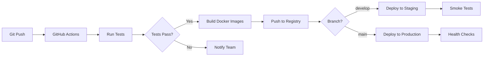

# TI4 Web App - Comprehensive Implementation Plan

## Executive Summary
This implementation plan provides a detailed, week-by-week roadmap for building a complete Twilight Imperium 4th Edition web application with Prophecy of Kings expansion. The plan leverages 60% existing code through repository extraction while building 40% new functionality.

**Timeline:** 28 weeks (7 months)  
**Team Size:** 4 developers + 1 designer  
**Budget Estimate:** $250,000 - $350,000  
**MVP Target:** Week 20  
**Full Launch:** Week 28

---

## Part 1: Team Structure & Roles

### Core Team Composition

#### **Lead Developer / Architect**
- Overall architecture decisions
- Boardgame.io integration
- Code review and quality control
- Repository extraction coordination

#### **Game Logic Developer**
- Game engine implementation
- Rule validation system
- Combat mechanics
- Phase management

#### **Frontend Developer**
- React/TypeScript components
- Three.js 3D visualization
- UI/UX implementation
- Animation systems

#### **Backend Developer**
- Server infrastructure
- Database design
- WebRTC/Chat systems
- API development

#### **UI/UX Designer** (Part-time)
- Interface design
- 3D asset coordination
- User experience flow
- Accessibility design

### Extended Team (As Needed)
- **3D Artist** (Contract) - Ship and structure models
- **QA Tester** (Week 16+) - Testing and bug reports
- **DevOps Engineer** (Week 20+) - Deployment and scaling

---

## Part 2: Pre-Development Phase (Week 0)

### Environment Setup
```bash
# 1. Create project structure
mkdir ti4-web-app && cd ti4-web-app
git init
npm init -y
npx lerna init

# 2. Setup monorepo
mkdir client server shared scripts docs
cd client && npm create vite@latest . -- --template react-ts
cd ../server && npm init -y
cd ../shared && npm init -y

# 3. Install global dependencies
npm install -g lerna typescript prisma
```

### Repository Extraction Setup
```bash
# Clone all source repositories
mkdir sources && cd sources
git clone https://github.com/AsyncTI4/ti4_web_new.git
git clone https://github.com/Lazik10/TwilightImperiumUltimate.git
git clone https://github.com/alpha-mouse/ti4calc.git
git clone https://github.com/KeeganW/ti4.git
git clone https://github.com/vonWolfehaus/von-grid.git
git clone https://github.com/AsyncTI4/TI4_map_generator_bot.git
```

### Initial Configuration
- Setup Docker environment
- Configure CI/CD pipelines
- Initialize database schemas
- Setup development tools (ESLint, Prettier, Husky)
- Create initial documentation structure

---

## Part 3: Phase-by-Phase Implementation

## 🏗️ Phase 1: Foundation & Data Extraction (Weeks 1-4)

### Week 1: Project Setup & AsyncTI4 Fork
**Team Focus:** All team members

#### Day 1-2: Repository Setup
```typescript
// Tasks:
- Fork AsyncTI4/ti4_web_new as base
- Setup Lerna monorepo structure
- Configure TypeScript paths
- Setup shared types package
- Initialize Git flow
```

#### Day 3-4: Data Extraction Pipeline
```javascript
// scripts/extraction/extract-all.js
async function setupExtraction() {
  // 1. Extract TypeScript types from AsyncTI4
  await extractTypes('sources/ti4_web_new', 'client/src/types');
  
  // 2. Setup C# to JSON converter for TwilightImperiumUltimate
  await setupCSharpParser();
  
  // 3. Configure combat engine extraction from ti4calc
  await prepareCombatPort();
}
```

#### Day 5: Team Alignment
- Code style guide establishment
- Git workflow agreement
- Task distribution system setup
- Daily standup schedule

**Deliverables:**
- ✅ Complete project structure
- ✅ Development environment running
- ✅ Base TypeScript types extracted
- ✅ CI/CD pipeline configured

### Week 2: Data Model Implementation
**Lead:** Game Logic Developer  
**Support:** Backend Developer

#### Data Conversion Tasks
```typescript
// Convert C# models to TypeScript
interface ConversionTasks {
  factions: 'TwilightImperiumUltimate/Data/Factions/*.cs' -> 'client/src/data/factions',
  cards: 'TwilightImperiumUltimate/Data/Cards/*.cs' -> 'client/src/data/cards',
  technologies: 'TwilightImperiumUltimate/Data/Technologies/*.cs' -> 'client/src/data/technologies',
  planets: 'TwilightImperiumUltimate/Data/Planets/*.cs' -> 'client/src/data/planets',
  leaders: 'TwilightImperiumUltimate/Data/Leaders/*.cs' -> 'client/src/data/leaders', // PoK
  exploration: 'TwilightImperiumUltimate/Data/Exploration/*.cs' -> 'client/src/data/exploration', // PoK
}
```

#### Database Schema Creation
```sql
-- PostgreSQL setup with Prisma
npx prisma init
npx prisma migrate dev --name init
npx prisma generate
```

**Deliverables:**
- ✅ All game data converted to TypeScript
- ✅ Database schema implemented
- ✅ Data validation tests written
- ✅ Asset pipeline configured

### Week 3: Combat Engine Port
**Lead:** Game Logic Developer  
**Support:** Frontend Developer

#### Combat System Integration
```typescript
// Port from ti4calc
class CombatEngine {
  // Extract from ti4calc/combat.js
  calculateSpaceCombat(attacker: Fleet, defender: Fleet): CombatResult
  calculateGroundCombat(attacker: GroundForces, defender: GroundForces): CombatResult
  
  // New additions for complete combat
  calculateSpaceCannon(units: Unit[]): SpaceCannonResult  // NEW
  calculateBombardment(fleet: Fleet): BombardmentResult   // NEW
  calculateAFB(units: Unit[]): AFBResult                  // NEW
}
```

**Deliverables:**
- ✅ Combat engine ported and tested
- ✅ Probability calculator integrated
- ✅ Advanced combat mechanics added
- ✅ Combat unit tests complete

### Week 4: Board & Movement System
**Lead:** Frontend Developer  
**Support:** Game Logic Developer

#### Hexagonal Grid Integration
```typescript
// Integrate von-grid
import { HexGrid } from './three/geometry/HexGrid'; // From von-grid

class BoardManager {
  grid: HexGrid;
  tiles: Map<HexCoordinate, SystemTile>;
  
  // Movement system
  calculateMovement(fleet: Fleet, from: Hex, to: Hex): MovementPath
  validateFleetSupply(player: Player, hex: Hex): boolean
  
  // Wormhole network (NEW)
  getWormholeConnections(hex: Hex): Hex[]
  applyAnomalyEffects(hex: Hex, fleet: Fleet): Effect[]
}
```

**Deliverables:**
- ✅ Hexagonal grid system working
- ✅ Map generation from KeeganW/ti4
- ✅ Movement validation complete
- ✅ Wormhole networks implemented

---

## 🎮 Phase 2: Game Engine Core (Weeks 5-10)

### Week 5: Boardgame.io Setup
**Lead:** Lead Developer  
**Support:** Full team

#### Game Definition
```typescript
// client/src/game/boardgame-io/TI4Game.ts
export const TI4Game = {
  name: 'twilight-imperium-4',
  
  setup: (ctx) => ({
    board: generateMap(ctx.numPlayers),
    players: initializePlayers(ctx.numPlayers),
    currentPhase: 'strategy',
    round: 1,
  }),
  
  phases: {
    strategy: StrategyPhase,
    action: ActionPhase,
    status: StatusPhase,
    agenda: AgendaPhase,
  },
  
  moves: {
    // Define all game moves
  },
  
  endIf: (G, ctx) => checkVictoryConditions(G),
}
```

**Deliverables:**
- ✅ Boardgame.io integration complete
- ✅ Basic game flow working
- ✅ State management configured
- ✅ Multiplayer foundation ready

### Week 6-7: Phase Implementation
**Lead:** Game Logic Developer  
**Support:** Backend Developer

#### Strategy Phase
```typescript
class StrategyPhase {
  selectStrategyCard(G, ctx, cardId: string)
  passStrategySelection(G, ctx)
  determineSpeaker(G, ctx)
}
```

#### Action Phase
```typescript
class ActionPhase {
  tacticalAction(G, ctx, systemId: string)
  strategicAction(G, ctx)
  componentAction(G, ctx, component: Component)
  passAction(G, ctx)
}
```

**Deliverables (Week 6):**
- ✅ Strategy phase complete
- ✅ Action phase structure
- ✅ Turn order management

**Deliverables (Week 7):**
- ✅ Status phase complete
- ✅ Agenda phase complete
- ✅ Phase transitions working

### Week 8-9: Action Validation System
**Lead:** Game Logic Developer  
**Support:** Frontend Developer

#### Validation Framework
```typescript
class ActionValidator {
  validateTacticalAction(state: GameState, action: TacticalAction): ValidationResult
  validateMovement(state: GameState, movement: Movement): ValidationResult
  validateBuild(state: GameState, build: BuildAction): ValidationResult
  validateCombat(state: GameState, combat: Combat): ValidationResult
  validateTrade(state: GameState, trade: Trade): ValidationResult
}
```

**Deliverables (Week 8):**
- ✅ Movement validation complete
- ✅ Build validation complete
- ✅ Combat validation complete

**Deliverables (Week 9):**
- ✅ Trade validation complete
- ✅ Technology validation complete
- ✅ Politics validation complete

### Week 10: Faction Abilities
**Lead:** Game Logic Developer  
**Support:** Full team

#### Faction System
```typescript
class FactionManager {
  abilities: Map<FactionId, FactionAbility[]>;
  
  applyFactionAbility(faction: Faction, ability: Ability, context: Context)
  validateFactionAction(faction: Faction, action: Action): boolean
  getFactionModifiers(faction: Faction): Modifiers
}
```

**Deliverables:**
- ✅ All base faction abilities implemented
- ✅ Faction-specific technologies
- ✅ Starting unit configurations
- ✅ Faction ability tests

---

## 🎴 Phase 3: Prophecy of Kings Content (Weeks 11-13)

### Week 11: Exploration System
**Lead:** Game Logic Developer  
**Support:** Frontend Developer

#### Exploration Implementation
```typescript
class ExplorationManager {
  decks: {
    cultural: ExplorationDeck,
    industrial: ExplorationDeck,
    hazardous: ExplorationDeck,
  }
  
  explore(planet: Planet, player: Player): ExplorationCard
  attachFragment(fragment: RelicFragment, player: Player)
  attachPlanetAttachment(attachment: Attachment, planet: Planet)
}
```

**Deliverables:**
- ✅ Exploration deck system
- ✅ Frontier tokens
- ✅ Relic fragments
- ✅ Planet attachments

### Week 12: Leaders System
**Lead:** Game Logic Developer  
**Support:** Backend Developer

#### Leader Implementation
```typescript
class LeaderManager {
  agents: Map<FactionId, Agent>;
  commanders: Map<FactionId, Commander>;
  heroes: Map<FactionId, Hero>;
  
  deployAgent(agent: Agent, location: Location)
  unlockCommander(player: Player): Commander
  purgeHero(hero: Hero): HeroEffect
  
  // Alliance mechanics
  formAlliance(player1: Player, player2: Player)
}
```

**Deliverables:**
- ✅ Agent abilities for all factions
- ✅ Commander unlock conditions
- ✅ Hero purge effects
- ✅ Alliance promissory notes

### Week 13: Mechs & New Factions
**Lead:** Game Logic Developer  
**Support:** Frontend Developer

#### Mech System
```typescript
class MechManager {
  mechs: Map<FactionId, MechUnit>;
  
  deployMech(player: Player, planet: Planet)
  applyMechAbility(mech: MechUnit, context: Context)
  validateMechCombat(mech: MechUnit, combat: Combat)
}
```

**Deliverables:**
- ✅ All faction mechs implemented
- ✅ 7 new PoK factions complete
- ✅ New faction abilities tested
- ✅ Complete PoK integration

---

## 🚀 Phase 4: Advanced Combat & Movement (Weeks 14-15)

### Week 14: Advanced Combat Mechanics
**Lead:** Game Logic Developer  
**Support:** Frontend Developer

#### Space Cannon System
```typescript
class SpaceCannon {
  offense(attacker: Unit[], target: Hex): SpaceCannonResult
  defense(defender: Unit[], incoming: Fleet): SpaceCannonResult
  
  // Deep space cannon
  deepSpaceCannon(pds: Unit[], target: Hex): boolean
}
```

#### Bombardment & AFB
```typescript
class AdvancedCombat {
  bombardment(fleet: Fleet, planet: Planet): BombardmentResult
  antiFighterBarrage(units: Unit[]): AFBResult
  sustainDamage(unit: Unit): boolean
  repair(unit: Unit): boolean
}
```

**Deliverables:**
- ✅ Space cannon offense/defense
- ✅ Bombardment system
- ✅ Anti-fighter barrage
- ✅ Retreat mechanics

### Week 15: Movement & Anomalies
**Lead:** Game Logic Developer  
**Support:** Backend Developer

#### Advanced Movement
```typescript
class MovementSystem {
  // Wormhole networks
  wormholes: {
    alpha: WormholeNetwork,
    beta: WormholeNetwork,
    gamma: WormholeNetwork,
  }
  
  // Anomaly effects
  applyGravityRift(movement: Movement): Movement
  applyNebula(combat: Combat): Combat
  applySupernova(units: Unit[]): Damage
  applyAsteroidField(units: Unit[]): Effect
}
```

**Deliverables:**
- ✅ Complete wormhole network
- ✅ All anomaly effects
- ✅ Fleet supply validation
- ✅ Capacity checking

---

## 🎨 Phase 5: 3D Visualization (Weeks 16-18)

### Week 16: Three.js Scene Setup
**Lead:** Frontend Developer  
**Support:** UI/UX Designer

#### 3D Board Creation
```typescript
class Board3D {
  scene: THREE.Scene;
  camera: THREE.PerspectiveCamera;
  renderer: THREE.WebGLRenderer;
  
  hexGrid: HexGrid3D;
  units: Map<UnitId, Unit3D>;
  
  initialize()
  addTile(tile: SystemTile, position: Vector3)
  addUnit(unit: Unit, position: Vector3)
}
```

**Deliverables:**
- ✅ Three.js scene initialized
- ✅ Camera controls working
- ✅ Basic hex grid rendered
- ✅ Lighting system setup

### Week 17: 3D Models & Animation
**Lead:** Frontend Developer  
**Support:** 3D Artist (Contract)

#### Model Integration
```typescript
class ModelManager {
  loadShipModels()
  loadStructureModels()
  loadMechModels() // PoK
  
  createFleet(composition: FleetComposition): Group
  animateMovement(unit: Unit3D, path: Vector3[])
  animateCombat(attacker: Unit3D, defender: Unit3D)
}
```

**Deliverables:**
- ✅ All unit models loaded
- ✅ Movement animations
- ✅ Combat animations
- ✅ Build animations

### Week 18: Performance Optimization
**Lead:** Frontend Developer  
**Support:** Lead Developer

#### Optimization Techniques
```typescript
class PerformanceOptimizer {
  implementLOD(units: Unit3D[])       // Level of detail
  implementInstancing(similar: Mesh[]) // GPU instancing
  implementCulling(objects: Object3D[]) // Frustum culling
  createTextureAtlas(textures: Texture[])
}
```

**Deliverables:**
- ✅ 60 FPS performance achieved
- ✅ Mobile performance acceptable
- ✅ Memory usage optimized
- ✅ Loading times minimized

---

## 🌐 Phase 6: Multiplayer Infrastructure (Weeks 19-21)

### Week 19: Server Setup & Lobby
**Lead:** Backend Developer  
**Support:** Lead Developer

#### Server Configuration
```typescript
// server/src/index.ts
const server = Server({
  games: [TI4Game],
  
  origins: [
    'http://localhost:3000',
    'https://ti4.game',
  ],
  
  db: new PostgreSQLDatabase({
    url: process.env.DATABASE_URL,
  }),
  
  transport: new SocketIO(),
});
```

#### Lobby System
```typescript
class LobbyManager {
  createGame(settings: GameSettings): GameRoom
  joinGame(gameId: string, player: Player)
  startDraft(draftType: DraftType)
  readyCheck(): boolean
}
```

**Deliverables:**
- ✅ Boardgame.io server running
- ✅ Lobby system complete
- ✅ Game creation flow
- ✅ Player slot management

### Week 20: Faction Draft & Game Start (MVP)
**Lead:** Full Team  
**Focus:** MVP Completion

#### Draft Systems
```typescript
class DraftSystem {
  snakeDraft(players: Player[]): DraftResult
  miltyDraft(players: Player[]): DraftResult
  randomDraft(players: Player[]): DraftResult
  
  selectFaction(player: Player, faction: Faction)
  selectMapPosition(player: Player, position: number)
}
```

**MVP Deliverables:**
- ✅ Complete game playable
- ✅ All factions working
- ✅ PoK content integrated
- ✅ Basic multiplayer functional
- ✅ Draft system complete
- ✅ **MVP ACHIEVED**

### Week 21: Connection Management
**Lead:** Backend Developer  
**Support:** Frontend Developer

#### Robust Networking
```typescript
class ConnectionManager {
  handleReconnection(player: Player)
  syncGameState(player: Player)
  handleLatency(action: Action)
  
  // Offline queue
  queueOfflineActions(actions: Action[])
  syncOnReconnect()
}
```

**Deliverables:**
- ✅ Reconnection handling
- ✅ State synchronization
- ✅ Latency compensation
- ✅ Offline action queue

---

## 💬 Phase 7: Social Features (Weeks 22-23)

### Week 22: Chat & Communication
**Lead:** Backend Developer  
**Support:** Frontend Developer

#### Chat System
```typescript
class ChatSystem {
  publicChat(message: Message)
  teamChat(message: Message, team: Team)
  whisper(message: Message, recipient: Player)
  
  emotes: EmoteWheel
  quickMessages: QuickMessage[]
  
  moderation: {
    mute(player: Player)
    report(message: Message)
    filter(content: string): string
  }
}
```

#### Transaction Negotiator
```typescript
class TransactionNegotiator {
  proposeTransaction(transaction: Transaction)
  counterOffer(counter: Transaction)
  acceptTransaction(transaction: Transaction)
  
  validateTransaction(transaction: Transaction): boolean
  escrow(items: Tradeable[])
}
```

**Deliverables:**
- ✅ Complete chat system
- ✅ Emote wheel
- ✅ Transaction negotiator
- ✅ Chat moderation tools

### Week 23: Voice/Video & Friends
**Lead:** Backend Developer  
**Support:** DevOps Engineer

#### WebRTC Integration
```typescript
class VoiceVideoSystem {
  initializeWebRTC()
  createPeerConnection(player: Player)
  
  voiceChat: {
    joinVoiceChannel(channel: VoiceChannel)
    muteToggle()
    volumeControl(player: Player, volume: number)
  }
  
  videoChat: {
    startVideo()
    shareScreen()
    pictureInPicture()
  }
}
```

**Deliverables:**
- ✅ Voice chat working
- ✅ Video chat optional
- ✅ Friends list system
- ✅ Notification system

---

## 📱 Phase 8: Companion & Mobile (Weeks 24-25)

### Week 24: Companion Mode
**Lead:** Frontend Developer  
**Support:** Full Team

#### Companion Features
```typescript
class CompanionMode {
  // Physical game tracking
  physicalMode: {
    trackState(state: ManualGameState)
    scanQRCode(): GameState
    capturePhoto(): BoardImage
  }
  
  // Advisory system
  advisor: {
    suggestMoves(): Move[]
    calculateProbabilities(): Odds
    objectiveHelper(): ObjectivePath
  }
}
```

**Deliverables:**
- ✅ Companion mode UI
- ✅ Physical game tracker
- ✅ Move advisor
- ✅ QR code scanner

### Week 25: Mobile Optimization & PWA
**Lead:** Frontend Developer  
**Support:** UI/UX Designer

#### Progressive Web App
```typescript
// service-worker.ts
self.addEventListener('install', (event) => {
  // Cache assets
  event.waitUntil(
    caches.open('ti4-v1').then(cache => {
      return cache.addAll(assetList);
    })
  );
});

// Offline support
self.addEventListener('fetch', (event) => {
  // Serve from cache when offline
});
```

**Deliverables:**
- ✅ PWA configured
- ✅ Mobile responsive UI
- ✅ Touch controls
- ✅ Offline mode working

---

## 🏁 Phase 9: Polish & Launch Prep (Weeks 26-28)

### Week 26: Tutorial & Help System
**Lead:** UI/UX Designer  
**Support:** Game Logic Developer

#### Tutorial System
```typescript
class TutorialSystem {
  interactiveTutorial: {
    basics: Step[]
    advanced: Step[]
    factionSpecific: Map<FactionId, Step[]>
  }
  
  practiceScenarios: Scenario[]
  contextualHints: Hint[]
  rulesReference: SearchableDatabase
}
```

**Deliverables:**
- ✅ Interactive tutorial complete
- ✅ Practice scenarios
- ✅ Contextual help system
- ✅ Rules reference searchable

### Week 27: Save/Load & Replay System
**Lead:** Backend Developer  
**Support:** Frontend Developer

#### Save System
```typescript
class SaveSystem {
  saveGame(state: GameState): SaveId
  loadGame(saveId: SaveId): GameState
  
  autoSave: {
    interval: number
    maxAutoSaves: number
  }
  
  cloudSync: {
    upload(save: Save)
    download(saveId: SaveId)
    merge(local: Save, cloud: Save)
  }
}
```

#### Replay System
```typescript
class ReplaySystem {
  recordGame(events: GameEvent[])
  playbackReplay(replayId: string)
  
  controls: {
    play(), pause(), speed(multiplier: number)
    jumpTo(turn: number)
  }
  
  shareReplay(replayId: string): ShareableLink
}
```

**Deliverables:**
- ✅ Save/load working
- ✅ Cloud save sync
- ✅ Basic replay viewer
- ✅ Replay sharing

### Week 28: Testing & Launch
**Lead:** Full Team  
**Support:** QA Tester

#### Final Testing
```bash
# Run all test suites
npm run test:unit
npm run test:integration
npm run test:e2e
npm run test:performance
npm run test:accessibility
```

#### Launch Checklist
- ✅ All features tested
- ✅ Performance optimized
- ✅ Security audit complete
- ✅ Load testing passed
- ✅ Documentation complete
- ✅ Marketing site ready
- ✅ **FULL LAUNCH**

---

## Part 4: Testing Strategy

### Test Coverage Requirements
```yaml
Unit Tests: 80% coverage minimum
Integration Tests: Critical paths covered
E2E Tests: Main user journeys
Performance Tests: 60 FPS, <3s load time
Accessibility Tests: WCAG 2.1 AA compliance
```

### Testing Schedule
- **Weeks 1-15:** Unit tests written alongside code
- **Week 16:** Integration testing begins
- **Week 20:** MVP testing sprint
- **Week 24:** E2E testing
- **Week 26:** Performance testing
- **Week 27:** Accessibility testing
- **Week 28:** Final QA sprint

---

## Part 5: Deployment Strategy

### Infrastructure Setup

#### Development Environment
```yaml
Environment: Local Docker
Database: PostgreSQL (Docker)
Cache: Redis (Docker)
Storage: Local filesystem
```

#### Staging Environment
```yaml
Environment: AWS/GCP
Servers: 2x t3.medium
Database: RDS PostgreSQL
Cache: ElastiCache Redis
Storage: S3
CDN: CloudFront
```

#### Production Environment
```yaml
Environment: AWS/GCP
Servers: Auto-scaling group (2-10 instances)
Database: RDS PostgreSQL (Multi-AZ)
Cache: ElastiCache Redis (Cluster)
Storage: S3 with CloudFront
Load Balancer: Application Load Balancer
Monitoring: DataDog + Sentry
```

### Deployment Pipeline


---

## Part 6: Risk Mitigation

### Technical Risks

#### Risk: Game State Synchronization Issues
**Mitigation:**
- Use Boardgame.io's built-in sync
- Implement state checksums
- Add reconciliation logic
- Extensive testing

#### Risk: Performance Problems with 3D
**Mitigation:**
- Progressive enhancement (2D fallback)
- Aggressive optimization from start
- LOD system implementation
- GPU instancing

#### Risk: Complex Rule Edge Cases
**Mitigation:**
- Study AsyncTI4 Java implementation thoroughly
- Engage TI4 community for testing
- Implement comprehensive logging
- Create rule validation suite

### Project Risks

#### Risk: Scope Creep
**Mitigation:**
- Strict MVP definition
- Feature freeze after Week 20
- Post-launch feature list
- Regular stakeholder communication

#### Risk: Team Member Loss
**Mitigation:**
- Knowledge documentation
- Pair programming
- Code reviews
- Bus factor > 1 for critical systems

---

## Part 7: Resource Allocation

### Budget Breakdown

#### Development Costs (28 weeks)
```
Lead Developer:      $80,000
Game Logic Dev:      $70,000
Frontend Dev:        $70,000
Backend Dev:         $70,000
UI/UX Designer:      $35,000 (part-time)
3D Artist:          $10,000 (contract)
QA Tester:          $15,000 (12 weeks)
---
Subtotal:          $350,000
```

#### Infrastructure Costs (Year 1)
```
Development:         $500/month x 7 = $3,500
Staging:            $500/month x 6 = $3,000
Production:         $2,000/month x 5 = $10,000
Services:           $500/month x 7 = $3,500
---
Subtotal:          $20,000
```

#### Additional Costs
```
Licenses/Tools:     $5,000
Marketing:          $10,000
Legal:              $5,000
Contingency (10%):  $39,000
---
Total Budget:      $429,000
```

---

## Part 8: Success Metrics

### Development Metrics
- ✅ Features completed on schedule
- ✅ Bug count < 50 at launch
- ✅ Test coverage > 80%
- ✅ Performance targets met

### Launch Metrics (First Month)
- 1,000+ registered users
- 100+ concurrent games
- < 2% crash rate
- 4.0+ app store rating

### Long-term Success (Year 1)
- 10,000+ active users
- 1,000+ daily games
- Break-even on costs
- Community engagement

---

## Part 9: Post-Launch Roadmap

### Month 1-2: Stabilization
- Bug fixes
- Performance optimization
- Balance adjustments
- Community feedback integration

### Month 3-4: Tournament System
- Swiss tournament support
- Bracket tournaments
- Scheduled events
- Leaderboards

### Month 5-6: Advanced Features
- Advanced replay analysis
- Spectator mode improvements
- Statistics dashboard
- Achievement system

### Month 7+: Expansion
- AI opponents
- Mod support
- Mobile native apps
- Additional languages
- Custom game modes

---

## Conclusion

This implementation plan provides a clear path from zero to launch in 28 weeks. The key success factors are:

1. **Leverage existing code** - 60% of work already done
2. **Experienced team** - 4 developers who know board games
3. **Incremental approach** - MVP at week 20, polish after
4. **Community engagement** - TI4 players involved throughout
5. **Technical excellence** - Modern stack, best practices

With disciplined execution of this plan, the TI4 web app will launch successfully and become the definitive digital implementation of Twilight Imperium 4th Edition.

**Next Steps:**
1. Secure funding
2. Assemble team
3. Begin Week 0 setup
4. Execute plan
5. Launch and iterate

*"The galaxy awaits its new digital emperor."*